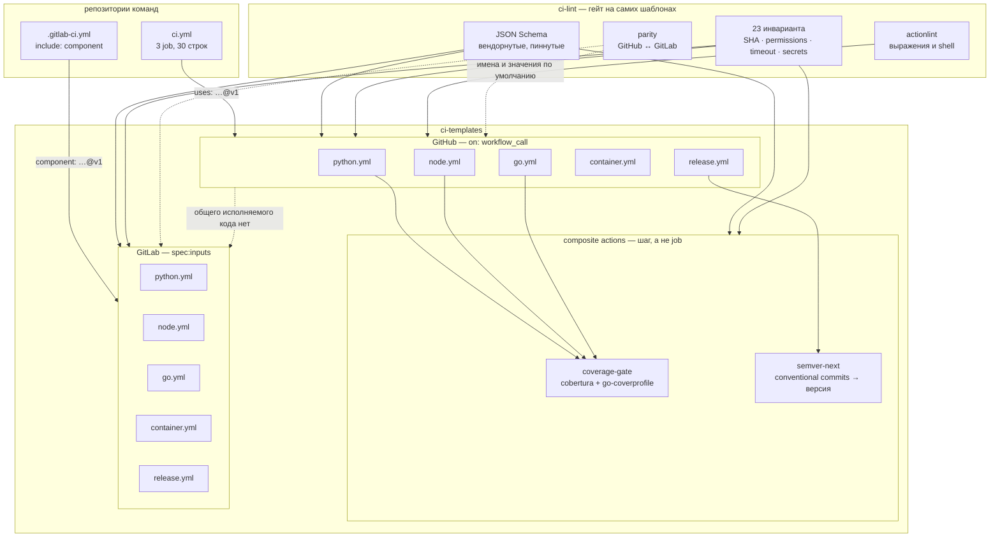

# ci-templates

Переиспользуемые пайплайны для GitHub Actions и GitLab CI — и, что важнее,
**линтер, который их проверяет**: схемы, `actionlint` и два десятка
инвариантов, которые схема выразить не может (пины по SHA, лишние `write`,
таймауты, секреты, объявленные и ни разу не прочитанные).

```bash
make demo    # проверить шаблоны, показать, как линтер отклоняет плохие, прогнать тесты
```

---

## Задача

Библиотеку CI-шаблонов написать нетрудно. Трудно — сделать так, чтобы через
полгода она не превратилась в то же самое, от чего уходили.

Исходное состояние типовое: одиннадцать репозиториев, в каждом свой
`ci.yml` на 150 строк, все одиннадцать — потомки одного, скопированного
когда-то из двенадцатого. Расхождения между копиями не являются решениями.
Это осадок от разных недель: здесь кто-то поднял `setup-node` до v4, там
не поднял; здесь порог покрытия 80, там 85, а в третьем месте гейт вообще
не срабатывает, потому что `[ "85.4%" -ge 70 ]` — это ошибка bash, которую
глушит `|| echo`. Все четыре примера в [`examples/`](examples/) содержат по
такому дефекту, и каждый из них прожил в оригинале месяцы.

Вынести это в переиспользуемые workflow — очевидный шаг. Неочевидная часть
начинается сразу после.

**Шаблон CI — это код, который никто не тестирует.** У него нет юнит-тестов,
потому что запустить его можно только на раннере. Его не запускают локально,
потому что локально нет `${{ github.event }}`. Единственный способ узнать,
что он сломан, — сломать чей-то пайплайн. И этот код при этом исполняется с
доступом к токену workflow во всех одиннадцати репозиториях сразу.

**Централизация усиливает ошибку ровно во столько раз, во сколько экономит
работу.** Пока `ci.yml` копипастился, опечатка в правах доступа жила в одном
репозитории. Общий шаблон с `permissions: write-all` — это `write-all`
в одиннадцати.

Поэтому основной объём этого репозитория — не шаблоны, а
[`tools/ci_lint`](tools/ci_lint): 23 правила, каждое с фикстурой, которая
его нарушает, и фикстурой, которая его соблюдает. Плюс проверка соответствия
интерфейсов между двумя CI-системами — единственное, что механически
удерживает GitHub- и GitLab-стороны от расхождения, потому что общего кода
у них нет и быть не может.

---

## Архитектура



Пунктирная связь внизу — главная честная деталь схемы. GitHub-шаблон и
GitLab-шаблон одного пайплайна **не разделяют ни строки исполняемого кода**.
Компонент GitLab — это один YAML-файл, скрипт в него положить нельзя.
Разделяется только интерфейс, и `parity` — единственное, что это проверяет.

### Что лежит где

```
.github/workflows/     python · node · go · container · release   (workflow_call)
.github/actions/       coverage-gate · semver-next                (composite)
gitlab/                те же пять пайплайнов как CI/CD-компоненты (spec:inputs)
schemas/               три JSON-схемы, пиннутые по ревизии, + SOURCES.md
tools/ci_lint/         линтер: схемы, инварианты, parity
tests/                 107 тестов, из них 12 негативных фикстур
examples/              вызывающие репозитории: было / стало
ci-lint.yaml           self-reference и 23 записанных расхождения между CI
```

---

## Решения и компромиссы

### Переиспользуемый workflow, composite action или репозиторий-шаблон

Три механизма, и выбор между ними — не вкусовщина: у каждого есть место,
где он перестаёт работать.

**Репозиторий-шаблон** (`Use this template`) отпадает первым. Он копирует
файлы один раз. Через месяц у одиннадцати потомков одиннадцать разных
версий, и это ровно то состояние, из которого мы уходим. Шаблон решает
задачу «начать», а задача здесь — «не разъехаться».

**Переиспользуемый workflow** (`on: workflow_call`) — единица уровня job.
Он приезжает со своим раннером, своим workspace и своим checkout. Это его
сила: вызывающий пишет три строки и не знает, что внутри. Это же и его
граница — он **не может** ничего сделать внутри чужого job. Не может
прочитать файл, который только что записал шаг тестов. Не может дописать
строку в job summary того job, где шли тесты.

**Composite action** — единица уровня шага, и существует ровно для этих
случаев. Обе composite-акции здесь выбраны по этому признаку, а не «чтобы
были»:

* `coverage-gate` обязан читать `coverage.xml`, который написал предыдущий
  шаг в том же workspace, и обязан писать в `$GITHUB_STEP_SUMMARY` того же
  job. Переиспользуемым workflow это недостижимо в принципе.
* `semver-next` возвращает три строки, которые следующий шаг того же job
  передаёт в `action-gh-release`. Через workflow это был бы второй раннер,
  второй checkout и выходы job вместо выходов шага.

Обратная сторона composite action: он **не изолирован**. Он исполняется в
том же процессе, видит те же переменные окружения и тот же workspace. Для
шага-гейта это приемлемо, для сборки — нет.

Есть и четвёртый вариант, который здесь сознательно не используется:
**`docker://` -экшен**. Он даёт настоящую изоляцию и версионирование по
дайджесту, но стоит вытягивания образа на каждом job и не работает на
Windows- и macOS-раннерах. Для гейта на 40 строк питона это плата в минуту
за задачу на полсекунды.

#### Место, где ломается сам механизм: ссылка на себя

Переиспользуемый workflow из этого репозитория вызывает composite action из
**этого же** репозитория. Написать `uses: ./.github/actions/coverage-gate`
нельзя: `./` разрешается относительно того, что лежит в workspace, а там —
репозиторий **вызывающего**. Единственная работающая форма —
`uses: lpogosu/ci-templates/.github/actions/coverage-gate@v1`.

И вот тут пиннинг по SHA становится невозможен физически: коммит, на который
надо сослаться, — это тот самый коммит, который сейчас пишется. Курица и
яйцо.

Решение — не замести это под ковёр, а сделать явным правилом. Линтер знает
из `ci-lint.yaml`, что `lpogosu/ci-templates/*` — это ссылка на себя, не
требует от неё SHA, но требует, чтобы ref был **ровно тем**, который
объявлен как релизный (`v1`). Правило называется `self-reference-ref`,
у него есть негативная фикстура, и оно ловит реальный класс аварии: workflow
с версии `v1.4` зовёт акцию тега `v2`, которого он никогда не видел.

Цена признаётся честно: между `workflow@<sha>` и `action@v1` остаётся щель.
Закрыть её могло бы только двухшаговое издание релиза — сначала тег, потом
коммит, переписывающий ссылки, — и это лекарство хуже болезни.

### Пины по SHA против тегов, и почему пиннинг бросают

Позиция «пинить базовый образ, но брать экшены по плавающему тегу»
внутренне противоречива: экшен исполняется с доступом к токену workflow.
`actions/checkout@v5` — это указатель, который владелец репозитория может
передвинуть в любой момент; передвинутый указатель — это выполнение чужого
кода в вашем CI. Поэтому здесь **каждый** `uses:` пиннут на 40-символьный
SHA коммита.

Но у пиннинга есть реальная цена, из-за которой команды его бросают, и
делать вид, что её нет, нечестно.

Тег читается. `# v7.0.1` рядом с SHA — это не украшение, это единственный
способ ответить на вопрос «мы отстали?» без похода в API. Поэтому правило
здесь двойное: `pinned-uses` требует SHA, а `pinned-uses-comment` требует
комментарий с версией на той же строке. Второе правило нельзя выполнить
автоматически — комментарии не исполняются, — и именно поэтому оно
проверяется.

Обновление становится ручной работой. Найти новый SHA, сверить, что он
принадлежит нужному тегу, обновить пять файлов. Через два-три цикла это
перестают делать, и репозиторий, который «пинит всё», оказывается
репозиторием, который сидит на релизах годичной давности. Это хуже
плавающего тега: плавающий тег хотя бы получает патчи безопасности.

Вывод, который стоит проговорить прямо: **пиннинг без Renovate или
Dependabot — это отложенная деградация, а не безопасность.** Инструмент
обновления здесь не роскошь, а условие работоспособности решения. Renovate
понимает конструкцию `SHA # tag` и умеет двигать обе части одновременно
(`helpers:pinGitHubActionDigests`) — вот почему формат «SHA плюс комментарий»
выбран именно такой, а не, например, SHA в отдельном файле версий.

В этом репозитории Renovate не настроен: он требует установленного
GitHub App, то есть состояния вне репозитория, и делать вид, что коммит его
включает, я не буду. Что настроено — линтер, который не даст добавить
неспиннутый `uses:`, и `make schemas-check`, который отдельно сообщает, что
вендорнутые схемы отстали.

Отдельно про образы. На стороне GitLab тот же вопрос стоит про `image:`, и
ответ тот же: дайджест. Но там появляется своя ловушка. Если сделать входным
параметром версию интерпретатора и подставлять её в тег
(`python:$[[ inputs.version ]]-slim`), дайджест исчезает — пиннуть нечего.
Поэтому входным параметром здесь является **вся ссылка целиком вместе с
дайджестом**, а правило `gitlab-pinned-image` проверяет значение по
умолчанию у того входа, который подставляется в `image:`. Вызывающий
по-прежнему может передать неспиннутый образ — но шаблон его никогда не
привезёт, и это разница между «нельзя» и «не по умолчанию».

### Порог покрытия — вход со значением по умолчанию, а не число в коде

`coverage-min` по умолчанию **0**, то есть гейт выключен. Это выглядит как
малодушие и является противоположностью.

Число, зашитое в общий шаблон, — это утверждение о чужом коде. 85% разумны
для сервиса с HTTP-слоем и бессмысленны для библиотеки-обёртки над одним
SDK, где половина строк — проброс аргументов. Общая библиотека не знает,
какой из одиннадцати репозиториев она обслуживает, и не имеет права решать
за них.

Второе, более важное: порог, назначенный извне и сразу, воспринимается как
чужое требование, и с ним поступают как с чужим требованием — обходят.
Работающий сценарий обратный: команда включает гейт на своём фактическом
уровне (`coverage-min: 62`), после чего он защищает от **регресса**, а не
требует героизма. Поднимать его дальше — отдельный, видимый в истории
коммит.

Почему тогда не «по умолчанию 80, кто хочет — снизит»? Потому что молчаливо
включённый гейт на общем шаблоне ломает пайплайн у всех одиннадцати в день
внедрения, и внедрение на этом заканчивается. Ноль по умолчанию — это
«библиотека ничего не решила за вас», а не «покрытие неважно».

И третье, что делает первые два не отговоркой: **гейт, который включили,
обязан работать**. Три из четырёх примеров в `examples/` содержат
самописный гейт покрытия, который не может упасть. Здесь гейт — это
[`gate.py`](.github/actions/coverage-gate/gate.py) с 13 тестами, среди
которых «пустой отчёт — это 0%, а не 100%», «отсутствующий файл — это код
возврата 2, а не 0» и «ровно на пороге — проход». Отсутствие отчёта
завершается кодом 2 отдельно от кода 1, потому что «тесты не дотянули» и
«гейт не смог запуститься» — разные события, и второе не должно выглядеть
как первое.

Один парсер обслуживает три экосистемы: Cobertura XML (coverage.py,
istanbul) и Go coverprofile. Для Go он суммирует statements прямо из
профиля — ту же арифметику, что печатает `go tool cover -func`, — и поэтому
шагу гейта не нужен тулчейн Go и он не может разойтись с профилем, который
написали тесты.

### Две CI-системы: что разделяется на самом деле

Соблазн описать это как «одна библиотека для двух платформ». Правда другая,
и она измерена.

Пять пайплайнов, 61 вход на стороне GitHub и 62 на стороне GitLab.
Из них **43 имеют одинаковое имя** (с точностью до `kebab-case` против
`snake_case`) и **41 совпадает ещё и значением по умолчанию**. Остальные
двадцать с лишним расхождений перечислены поимённо в `ci-lint.yaml`,
каждое — с фразой, почему иначе нельзя.

| Пайплайн | входов GitHub | входов GitLab | общих | из них с тем же default |
|---|---:|---:|---:|---:|
| python | 12 | 11 | 8 | 8 |
| node | 15 | 14 | 11 | 11 |
| go | 12 | 13 | 9 | 9 |
| container | 14 | 16 | 11 | 9 |
| release | 8 | 8 | 4 | 4 |
| **итого** | **61** | **62** | **43** | **41** |

То есть примерно две трети интерфейса переносимы, а треть — форма продукта,
а не наша лень. Расхождения группируются в четыре класса:

* **Выбор раннера.** У GitHub он на job (`runs-on`), у GitLab — на пайплайн
  (`default:tags` в файле вызывающего). Вход на стороне компонента сделал
  бы только хуже.
* **Выбор тулчейна.** GitHub ставит его экшеном `setup-*` в виртуалку,
  поэтому это строка `"3.13"`. GitLab запускает job внутри образа, поэтому
  это ссылка с дайджестом. Одним входом это не выражается.
* **Имя и порядок job.** У GitLab имена глобальны для пайплайна, поэтому
  нужны `stage` и `job_prefix`. У GitHub id job выбирает вызывающий, и
  коллизии невозможны.
* **Объекты, которых нет у соседа.** GitLab-релиз не бывает черновиком,
  GitHub не даёт предопределённого пути реестра проекта.

Что при этом **не** разделяется вообще: исполняемый код. Компонент GitLab —
это один YAML-файл, к нему нельзя приложить скрипт. Поэтому гейт покрытия
на GitHub — composite action с тестами, а на GitLab — родной флаг
экосистемы (`--cov-fail-under`, `--coverage.thresholds.lines`, awk по
профилю Go). Работает и там и там; но сообщение об ошибке в трёх
экосистемах разное, и централизованно протестировать его нельзя.

Хуже всего это выглядит в `release`: арифметика версии написана дважды —
в `next.sh` и в скрипте GitLab-компонента. Дублирование настоящее.
`parity` держит в согласии входы; **шелл-реализации не держит в согласии
ничто, кроме ревью**, и в шапке `gitlab/release.yml` это написано прямо.
Реальный выход для команды, у которой обе системы боевые, — собрать тулинг
в маленький образ и вызывать его из обеих; здесь такого образа нет, и
изображать, что проблема решена, было бы враньём.

Стоило ли вообще поддерживать две системы? В миграции — да, и именно
поэтому: полгода, когда половина сервисов уже переехала, а половина нет, —
это и есть момент, когда пороги расходятся незаметно. Если бы система была
одна, вторую половину этого репозитория (`parity`, половина `ci-lint.yaml`)
писать не следовало.

### Сборка, скан, потом push — именно в этом порядке

Типовой контейнерный пайплайн собирает, пушит и сканирует. Всё, что найдёт
такой скан, уже лежит в реестре и уже вытягивается по тегу. Это не гейт,
это уведомление. Классика жанра — `allow_failure: true` рядом с ним, как в
[`examples/gitlab-python-service`](examples/gitlab-python-service).

Здесь порядок другой: сборка локально → скан локального образа → и только
после чистого скана push. На GitHub вторая сборка — это проигрывание слоёв
из кеша buildx, то есть плата за порядок составляет один заход buildx, а не
одну сборку.

Дальше начинается разница между платформами, и она поучительна.

На GitLab образ путешествует между job **артефактом-тарболлом**, а job
пуша делает `docker load` ровно этих байт. Пушится доказуемо то, что
сканировалось. Плата — предел на размер артефакта: образ крупнее
`artifacts:max_size` так не проедет, и в README компонента написано, что
делать в этом случае (пушить во временный тег и сканировать по ссылке).

На GitHub тот же трюк означал бы прогон нескольких сотен мегабайт через
Actions cache дважды, что дороже пересборки. Поэтому там сборка
повторяется из кеша, и утверждение слабее: пушится **эквивалентный** образ,
а не доказуемо тот же. Разница честная, и она в комментарии над job.

Отдельно названа дыра: гейт смотрит один платформенный вариант
(`linux/amd64`), потому что `--load` не умеет импортировать manifest list.
Уязвимость, живущая только в arm64-варианте, здесь не ловится. Это
записано в шапке `container.yml`, а не спрятано.

`ignore-unfixed` по умолчанию включён. Находка без выпущенного исправления
— это то, с чем команда сервиса не может сделать ничего; гейт, который
нельзя удовлетворить, — это гейт, который выключают целиком, вместе с теми
находками, которые исправить было можно.

### Чего линтер не доказывает

Это главное ограничение, и его надо назвать раньше, чем список правил.

**Переиспользуемый workflow нельзя протестировать как код.** У него нет
входной точки, которую можно вызвать. Единственный настоящий тест — прогон
на раннере с настоящим `github`-контекстом, а он требует пуша, секретов и
чужого репозитория в роли вызывающего.

Поэтому здесь честно разделено на три уровня по силе утверждения.

**Что проверяется по-настоящему, исполнением.** Логика, которую удалось
вынести в код: `gate.py` (13 тестов, включая пустой отчёт, отсутствующий
файл и точное попадание в порог) и `next.sh` — 16 тестов **на настоящих
git-репозиториях**, создаваемых во временном каталоге. Там проверяются
именно те вещи, на которых такие скрипты ломаются: сортировка тегов
(`v1.10.0` против `v1.9.0` — алфавитно порядок обратный), merge-коммиты,
пустой диапазон, чужие теги в том же репозитории, `BREAKING CHANGE` в теле
коммита в обоих написаниях. Это уже не «шаблон CI», это обычный код, и он
покрыт как обычный код.

**Что проверяется структурно.** Схема отвечает на вопрос «это вообще
валидный файл». Инварианты отвечают на вопрос «нет ли здесь известного
класса ошибки». `actionlint` разбирает выражения `${{ }}`, знает контексты
и типы и ловит `nosuchfunc(1)` и обращение к несуществующему шагу.
Это сильные проверки, но все они — о тексте.

**Что не проверяется ничем.** Что `pytest --cov` действительно напишет
`coverage.xml`. Что `docker buildx` соберёт образ. Что GitLab примет
`rules:if` в том виде, в каком он написан. Что матрица развернётся в
ожидаемое число job. Любое утверждение вида «этот пайплайн работает» здесь
не доказано и не заявлено.

Что из этого следует практически: линтер ловит класс ошибок «этот файл
опасен или разъехался», и не ловит класс «этот файл не делает того, что
задумано». Второй класс закрывается только прогоном, и прогон — следующая
работа, а не сделанная.

### Правила: почему именно эти двадцать три

Общий принцип отбора: правило попадает сюда, только если его нельзя выразить
схемой и оно ловит ошибку, которая **выглядит как рабочий файл**.

Четыре центральных:

* **`pinned-uses` / `pinned-uses-comment`** — обсуждены выше.
* **`job-timeout`** — таймаут по умолчанию у GitHub шесть часов. Job,
  подвисший на сетевом чтении, стоит шесть часов оплаченного раннера и
  занимает слот в очереди. Тонкость, которую правило обязано знать:
  GitHub **не принимает** `timeout-minutes` на job, вызывающем
  переиспользуемый workflow. Поэтому такие job из требования исключены —
  таймаут обязан жить в вызываемом workflow, и там он проверяется. Без этой
  оговорки правило заваливало бы любой корректный файл вызывающего; тест
  `test_caller_job_needs_no_timeout` держит это поведение.
* **`permissions-*`** — самое интересное и единственное эвристическое.
* **`unused-secret` / `undeclared-secret`** — про интерфейс.

**Про права.** Проверить «эти права минимальны» невозможно: для этого надо
знать, что делает каждый экшен. Поэтому правило ищет **свидетельство**: для
`contents: write` — шаг, который похож на создание релиза, тега или пуша;
для `packages: write` — логин в реестр или push образа; для
`id-token: write` — cosign, OIDC-логин в облако, аттестацию. Нет
свидетельства — находка.

Это эвристика, и она названа эвристикой в описании правила. Она даёт ложные
срабатывания, и поэтому есть аварийный выход: комментарий
`# ci-lint: allow permissions-unjustified-write -- <причина>`. Причина
обязательна и не короче 20 символов; комментарий без причины превращается
в **другую** находку, `suppression-without-reason`. Замолчать правило,
ничего не сказав, нельзя — это ровно то свойство, которого не хватает
`.trivyignore` и `# noqa`.

Отдельно исключён случай, где эвристика заведомо бессильна: job, который
только вызывает чужой переиспользуемый workflow, пробрасывает права внутрь
кода, которого линтер не видит. Для таких job проверка обоснованности
выключена (а вызываемый workflow проверяется сам по себе), но проверка
`write-all` остаётся: пробросить всё — никогда не минимальный грант.

**Про секреты.** `unused-secret` — объявлен и ни разу не прочитан: вызывающий,
передающий его, уверен, что делает что-то полезное. `undeclared-secret` —
обратное: workflow читает `secrets.X`, которого не объявлял, а значит
работает только при `secrets: inherit` у вызывающего. Формально это законно;
практически это незадокументированный контракт, о котором вызывающий узнаёт
из красного пайплайна.

**`script-injection`** дублирует проверку `actionlint` и оставлен сознательно:
`actionlint` не разбирает `action.yml`, а composite action — такой же
исполняемый код с тем же доступом к контексту. Негативная фикстура
`tests/fixtures/bad/actions/loose-action` ловит именно этот случай.

**`parity-*`** — три правила на согласованность двух CI-систем, обсуждены
выше. У исключений есть собственное правило `parity-stale-exception`:
исключение, которое больше не нужно, — это записанная неправда, и оно
становится находкой.

Каждое правило из каталога имеет фикстуру. Это утверждение проверяется
тестом `test_every_rule_in_the_catalogue_has_a_fixture`, который сравнивает
множество правил, реально сработавших на негативных фикстурах, с каталогом
и падает при расхождении в любую сторону: правило без фикстуры и фикстура
без правила одинаково подозрительны.

### Схемы вендорятся, а не скачиваются

Три схемы лежат в `schemas/` копиями, пиннутыми по ревизии апстрима
(`SchemaStore` по SHA коммита, GitLab по тегу `v19.3.1-ee`). Валидатор,
который скачивает свои правила, краснеет утром, когда репозиторий никто не
трогал, и делает утверждение «неделю назад проходило» непроверяемым.

Плата — схемы устаревают молча. Поэтому есть `make schemas-check`: он
сравнивает копии с пиннутым апстримом и **не** запускается на pull request.
Чужой коммит в SchemaStore — не повод блокировать чужое ревью.

### Мелочи, каждая из которых стоила отладки

* **`on:` — это не булево.** PyYAML реализует YAML 1.1, где `on`, `off`,
  `yes` и `no` — булевы литералы. Загруженный так workflow имеет ключ
  `True` вместо `on`, и любое правило про триггеры молча ничего не находит.
  Резолвер булевых сужен до `true`/`false`, как это делают и GitHub, и
  `actionlint`, и сами JSON-схемы. Тест на это есть, потому что ошибка
  относится к классу «работает неправильно, не падая».
* **Позиции ключей и `mapping()`.** Номера строк хранятся по `id()` объекта.
  Хелпер `mapping()`, копировавший словарь «на всякий случай», лишал
  находки строки — все они указывали на строку 1. Теперь он возвращает
  исходный объект, если ключи уже строки, и в тесте это зафиксировано
  отдельным утверждением.
* **`secrets` недоступен в `if:` шага.** Опциональный токен поднимается в
  `env:` job — там `secrets` доступен — и шаг проверяет переменную. Иначе
  форк-PR краснеет на секрете, которого у него не может быть.
* **Пустой репозиторий — это ошибка, а не успех.** `ci-lint` без единого
  найденного файла возвращает 2. Возврат 0 на «нечего проверять» — то, как
  переименованный каталог превращается в вечно зелёный пайплайн.
* **Ноль строк в отчёте — это 0%, а не 100%.** Деление на ноль в гейте
  покрытия — самый тихий способ его отключить.
* **`--output type=docker` вместо `platforms` в GitLab-компоненте.** Вход,
  который реализация обязана игнорировать, хуже отсутствующего входа, и
  правило `gitlab-unused-input` не даёт его случайно оставить.
* **GitLab-релиз разбит на два job.** `release:` исполняется после `script`
  безусловно, поэтому решение «релизить или нет» обязано быть условием
  `rules:` отдельного job, питаемым dotenv-переменной от предыдущего.
* **Ветка `--` в шелле, а не интерполяция в `run:`.** Значения входов
  приезжают в шаги через `env:`, а не подставляются в тело скрипта. Здесь
  они доверенные; привычка нужна для случая, когда однажды окажется не так.

---

## Метрики

Всё измерено запуском на этой машине (Windows 11, Python 3.11.9); команды и
вывод — в конце раздела.

| | |
|---|---:|
| правил в каталоге | 23 |
| негативных фикстур | 12 |
| позитивных фикстур | 4 |
| тестов | 107 |
| покрытие `tools/ci_lint` | 94% |
| `ci-lint check` по 13 файлам | 0.47 с |
| `actionlint` по 6 workflow | 0 замечаний |

Размер того, что заменяется, — в [`examples/README.md`](examples/README.md);
коротко: 154 → 40, 65 → 18, 52 → 23, 108 → 20 строк. Множитель по
содержательным строкам от 2.5 до 7.1, и низкий край так же важен, как
высокий: Go-пайплайн мал сам по себе, и выигрыш там не в строках, а в том,
что его гейт покрытия начинает работать.

```
$ python -m ci_lint check --root .
13 file(s), 0 finding(s)

$ actionlint .github/workflows/*.yml
(пусто, код возврата 0)

$ python -m pytest
107 passed in 10.50s

$ python -m pytest --cov
TOTAL   639 stmts   27 miss   262 branch   29 partial   94%
```

Линтер на негативной фикстуре — то, ради чего он существует:

```
$ python -m ci_lint check --root . tests/fixtures/bad/workflows/no-timeout.yml
tests/fixtures/bad/workflows/no-timeout.yml:7: permissions-missing: no `permissions:` at
  workflow level and none on job(s) quick, slow; the repository default applies, and it is
  not read-only everywhere
tests/fixtures/bad/workflows/no-timeout.yml:8: job-timeout: job `quick` has no
  timeout-minutes; the default is six hours of a paid runner
tests/fixtures/bad/workflows/no-timeout.yml:13: job-timeout: job `slow` has no
  timeout-minutes; the default is six hours of a paid runner
1 file(s), 3 finding(s)
```

---

## Быстрый старт

Нужен Python 3.11+ и `make`. `actionlint` скачивается сам и сверяется с
записанным SHA-256.

```bash
git clone https://github.com/lpogosu/ci-templates
cd ci-templates
python3 -m pip install -e ".[dev]"

make demo     # проверить шаблоны, показать отклонение плохих, прогнать тесты
```

| Цель | Что делает |
|---|---|
| `demo` | `check` + `actionlint` + `reject` + `test` |
| `check` | `ci-lint` по шаблонам этого репозитория |
| `reject` | прогоняет линтер по всем «плохим» фикстурам и примерам «было»; успех — только если **каждый** отклонён |
| `actionlint` | ставит `actionlint` по SHA-256 и запускает его |
| `lint` | `ruff`, `mypy --strict`, `shellcheck` |
| `test` | `pytest` с покрытием |
| `rules` | печатает каталог правил с обоснованиями |
| `schemas-check` | сравнивает вендорнутые схемы с пиннутым апстримом |
| `clean` | убирает скачанный тулинг и вывод тестов |

### Как это подключают у себя

GitHub — три строки:

```yaml
jobs:
  test:
    uses: lpogosu/ci-templates/.github/workflows/python.yml@v1
    with:
      coverage-min: 85
```

GitLab — тоже три:

```yaml
include:
  - component: $CI_SERVER_FQDN/lpogosu/ci-templates/python@v1
    inputs:
      coverage_min: 85
```

Полные примеры «было / стало» — в [`examples/`](examples/).

### Линтер на чужом репозитории

`ci_lint` не привязан к этому репозиторию:

```bash
PYTHONPATH=/path/to/ci-templates/tools \
  python3 -m ci_lint check --root /path/to/your/repo
```

Схемы он ищет рядом с собой, а не в проверяемом репозитории;
`CI_LINT_SCHEMA_DIR` переопределяет это, если пакет вендорится отдельно.
`ci-lint.yaml` необязателен — без него отключены только `parity` и
`self-reference-ref`.

---

## Ограничения

Названы явно, потому что «прошло линтер» и «работает» — разные утверждения.

* **Ни один шаблон не прогонялся на настоящем раннере в рамках этой
  работы.** Проверено: структура, выражения, инварианты, версии экшенов и
  дайджесты образов. Не проверено: что job действительно проходят.
* **GitLab-шаблоны не проверялись линтером самого GitLab.** JSON-схема
  описывает `.gitlab-ci.yml` так, как GitLab его документирует, а не так,
  как его разбирает GitLab. Конструкции, в которых я меньше всего уверен, —
  интерполяция `$[[ inputs.* ]]` в `rules:if` (поэтому переключатели
  проходят через глобальные `variables:`, а не через сравнение литералов) и
  доступность dotenv-переменной в `rules:` зависимого job.
* **Эвристика прав доказывает наличие свидетельства, а не минимальность
  грантов.** Ложные срабатывания предполагаются и гасятся комментарием с
  обязательной причиной.
* **`parity` сверяет имена и значения по умолчанию, не семантику.** Вход
  `build_args` на GitLab разделяется по пробелам, на GitHub — по переводам
  строки. Имена и умолчания совпадают, поэтому правило молчит.
* **Арифметика версий существует в двух реализациях.** Тестами покрыта одна
  — `next.sh`. GitLab-вариант проверяется только чтением.
* **Renovate не настроен.** Пиннинг без автообновления деградирует; см.
  соответствующий раздел выше.
* **Контейнерный гейт смотрит одну платформу.** `linux/amd64`.
* **Порядок «скан → push» на GitHub даёт эквивалентность, а не
  тождественность байт.** На GitLab — тождественность, ценой предела на
  размер артефакта.

---

## Лицензия

MIT — см. [LICENSE](LICENSE).
